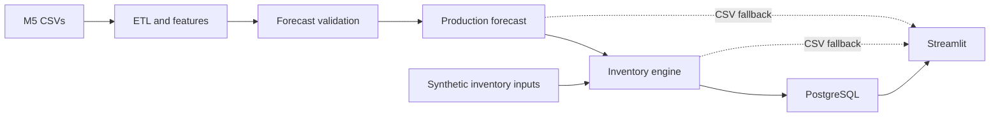

# SmartStock

SmartStock is an end-to-end retail demand forecasting and inventory optimization portfolio system built on the Walmart M5 dataset. It turns daily sales history into leakage-safe forecast evaluation, inventory recommendations, and an interactive application backed by PostgreSQL or a visible read-only CSV fallback.

Version 1.0 is complete and deployment-ready for local/container demonstration. It is not a Walmart production system, and no live cloud deployment is claimed.

## What SmartStock Does

SmartStock follows one reproducible chain from historical evidence to a business-facing decision:

```text
M5 data -> validation and ETL -> forecasting -> inventory policy
        -> PostgreSQL/CSV serving -> Streamlit dashboard
```

It models 100 FOOD products in three stores (`CA_1`, `TX_2`, `WI_3`), producing 300 item-store series and 582,300 long-format daily observations.

## Key Features

- Immutable raw-data workflow and deterministic V1 subset manifest.
- Active-period handling that preserves legitimate zero demand.
- Chronological, forecast-origin-safe evaluation across 1-, 7-, and 30-day horizons.
- Baseline, Ridge, HistGradientBoosting, and XGBoost comparison using multiple metrics.
- Evidence-based selection of a simple 28-day historical mean.
- Safety stock, reorder point, stockout risk, priority, and illustrative cost-aware ordering.
- PostgreSQL schema, validated idempotent loader, reusable parameterized queries, and health checks.
- Seven-section Streamlit dashboard with a transparent read-only CSV demo mode.
- Automated tests, Docker Compose configuration, and interview/portfolio documentation.

## Architecture



The [architecture guide](docs/architecture.md) clearly separates M5-derived information from synthetic demo inventory state.

## Dataset

SmartStock uses the official [Walmart M5 Forecasting — Accuracy competition data](https://www.kaggle.com/competitions/m5-forecasting-accuracy/data):

```text
data/raw/
├── calendar.csv
├── sales_train_evaluation.csv
└── sell_prices.csv
```

Downloaded and generated datasets are intentionally Git-ignored. Sign in to Kaggle, accept the competition terms, download the files, and place the three CSVs at those exact paths. Never commit Kaggle credentials.

## Data Pipeline

The pipeline validates raw schemas and joins, selects a reproducible demand-stratified FOOD subset, melts only the selected 300 wide rows, joins calendar and composite-key prices, profiles the active period, and builds target-safe features. See [pipeline.md](docs/pipeline.md) for the Stage 1–12 map.

## Forecasting

All model comparisons use three expanding 30-day validation folds. Every multi-step path is generated from a single origin, so Day +2 cannot use Day +1 actual demand. Price is excluded because future price schedules are not guaranteed.

The five baselines, Global Ridge, HistGradientBoosting, and XGBoost were compared across MAE, RMSE, WAPE, RMSSE, bias, fold stability, daily horizons, and aggregate horizons. The **28-Day Historical Mean** won the balanced validation ranking. This is a deliberate evidence-over-complexity result: the nonlinear models did not improve consistently enough to justify production selection.

The model was frozen before one evaluation on the locked 2016-04-23 to 2016-05-22 test. See [forecasting.md](docs/forecasting.md).

## Inventory Optimization

The engine combines a 30-day forecast with validation-only residual uncertainty to calculate inventory position, safety stock, reorder point, target stock, order quantity, stockout risk, and decision priority. A bounded scenario analysis demonstrates cost-aware alternatives.

**Important:** M5 has no real on-hand inventory, purchase orders, lead times, service levels, or costs. SmartStock's values for these fields—and all cost/savings results—are deterministic **synthetic demo assumptions**, not Walmart data or realized business impact. See [inventory.md](docs/inventory.md).

## Application

The Streamlit app includes Overview, Sales Analytics, Demand Forecasting, Inventory Health, Reorder Recommendations, Scenario Planner, and Methodology / About. The sidebar always identifies `PostgreSQL` or `Local demo files`; a database failure is never silently hidden. See [application.md](docs/application.md).

## Technology Stack

- Python 3.12, Pandas, NumPy
- scikit-learn, XGBoost, Joblib
- Matplotlib, JupyterLab
- PostgreSQL, SQLAlchemy, Psycopg 3
- Streamlit
- Docker and Docker Compose
- `unittest`, Git

## Results

### Forecasting — locked final test

| View | MAE | RMSE | WAPE | RMSSE |
|---|---:|---:|---:|---:|
| Daily, Days 1–30 | 1.382 | 2.387 | 61.20% | 0.764 |
| 30-day aggregate | 15.002 | 28.076 | 22.14% | 1.097 |

### Inventory — synthetic demonstration

- 198 service-level reorder recommendations totaling 4,143 units.
- 136 cost-optimized orders totaling 5,181 units.
- Expected shortage: 3,312.6 → 167.0 demo units.
- Illustrative expected cost: 16,937.5 → 4,892.6 demo currency units.
- Illustrative estimated savings: 12,044.8 demo currency units.

These inventory figures demonstrate engine behavior under simulated assumptions; they are not actual Walmart outcomes.

## Project Structure

```text
smartstock/
├── app/                   # Streamlit UI
├── config/                # Frozen version, model, feature, and policy manifests
├── data/                  # Raw and generated data (large contents Git-ignored)
├── docs/                  # Architecture, methods, deployment, and portfolio guides
├── models/                # Generated model artifacts (Git-ignored)
├── reports/               # Tracked evidence, metrics, summaries, and figures
├── scripts/               # Safe local demo helper
├── sql/                   # PostgreSQL schema
├── src/smartstock/        # Data, analysis, features, models, inventory, DB, utilities
├── tests/                 # Synthetic-fixture automated tests
├── Dockerfile
├── docker-compose.yml
├── pyproject.toml
└── requirements.txt
```

## Quick Start

Python 3.12 is the supported version. Restore the generated demo artifacts first; Git does not contain large data/model files.

```powershell
python -m venv .venv
.\.venv\Scripts\Activate.ps1
python -m pip install --upgrade pip
python -m pip install -r requirements.txt
python -m smartstock.utils.environment_check
python -m smartstock.utils.health_check
$env:SMARTSTOCK_DATA_MODE="csv"
python -m streamlit run app/streamlit_app.py
```

On Windows, `./scripts/run_demo.ps1` runs the checks and starts CSV mode without changing execution policy.

## PostgreSQL Setup

Create an empty PostgreSQL database, copy `.env.example` to the ignored `.env`, and set your own `DATABASE_URL`:

```powershell
python -m smartstock.database.initialize_database
python -m smartstock.database.verify_database
$env:SMARTSTOCK_DATA_MODE="postgres"
python -m streamlit run app/streamlit_app.py
```

See [database_setup.md](docs/database_setup.md). `--refresh` is a deliberate destructive reload option; normal initialization is idempotent.

## Docker

With Docker Desktop running and generated artifacts present on the host:

```powershell
docker compose config
docker compose up --build
```

Open `http://localhost:8501`. Compose health-checks PostgreSQL, initializes the schema/data, then starts the app. Large raw data is excluded from the image; required generated artifacts are read-only bind mounts. See [deployment.md](docs/deployment.md).

## Testing

```powershell
python -m unittest discover -s tests -v
python -m compileall src tests app
python src/smartstock/data/validate_raw_data.py
```

Tests use small synthetic fixtures and do not require live PostgreSQL. The final QA evidence is in [stage12_final_qa_report.md](reports/stage12_final_qa_report.md).

## Methodology

- [Architecture](docs/architecture.md)
- [Pipeline](docs/pipeline.md)
- [Forecasting](docs/forecasting.md)
- [Inventory decisions](docs/inventory.md)
- [Application](docs/application.md)
- [Deployment](docs/deployment.md)
- [Interview guide](docs/interview_guide.md)

## Limitations

- Only 100 FOOD items and three stores are included.
- Historical sales may be censored by stockouts.
- Inventory balances, lead times, service targets, and costs are synthetic.
- The final point forecaster is intentionally simple and excludes future prices/promotions.
- The normal forecast-error approximation may not fit every intermittent series.
- Supplier constraints, MOQ/case packs, capacity, and shelf life are not modeled.
- V1 has no authentication, production monitoring, or live cloud deployment.
- No open-source license has been selected yet.

## Future Improvements

V2 candidates include direct probabilistic multi-horizon forecasting, price/promotion scenarios, real ERP and supplier integration, MOQ/case-pack/perishability constraints, an API, scheduled retraining, monitoring, and role-based authentication.

## Author / Contact

Add the project owner's preferred public portfolio contact before publishing. No private contact information is stored in this repository.
