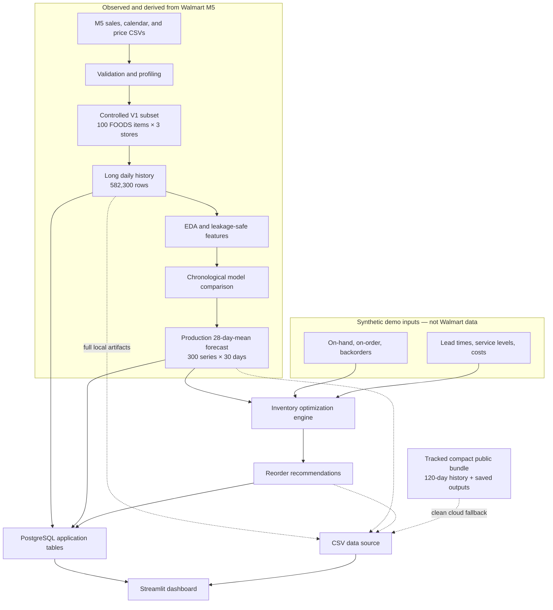

# SmartStock V1 architecture

SmartStock separates the historical M5 evidence from the simulated operational inputs that M5 does not provide. The two streams meet only inside the inventory decision layer.

## Responsibility boundaries

- `src/smartstock/data`, `analysis`, and `features` turn immutable raw inputs into documented analytical artifacts.
- `src/smartstock/models` evaluates forecasts without allowing validation-period targets into a 30-day forecast path.
- `src/smartstock/inventory` consumes forecasts plus explicitly synthetic business state; it has no UI or database dependency.
- `src/smartstock/database` owns the schema, validated loading, parameterized queries, and source selection.
- `app/` renders a four-section decision experience and delegates all forecasting and inventory calculations to existing project logic.
- `config/` freezes decisions; `reports/` preserves evidence; large generated datasets and models stay outside Git. `data/public_demo/` is the deliberate small exception for a self-contained portfolio deployment.

PostgreSQL remains supported as the application store. The CSV adapter prefers complete local Stage 10 artifacts and otherwise uses the committed compact bundle. The bundle copies authoritative saved forecasts and recommendations without retraining or recalculating them.
