# SmartStock Stage 5 — Exploratory Data Analysis & Modeling Readiness

Generated at `2026-08-13T03:10:17+00:00` from the frozen SmartStock Version 1 dataset.

> Stage 5 is descriptive and observational. It does not modify the Version 1 data, persist production features, split data, or train forecasting models.

## Executive Summary

The validated dataset contains **582,300 rows**, **100 products**, **3 stores**, and **300 complete item-store series**. Apparent pre-launch history accounts for **101,794 rows (17.48%)**. After availability begins, **49.07%** of observations still have zero demand, confirming that intermittency is a genuine modeling challenge rather than only a launch artifact.

Active daily demand is right-skewed: its median is **1.00**, mean is **2.39**, p99 is **27.00**, and maximum is **196** units. Demand bands remain behaviorally distinct after launch, while stores, departments, weekdays, calendar events, SNAP flags, price histories, and launch timing all show measurable differences that can justify carefully designed future features.

Most price series change over time (**78.33%**), but the observed price-demand comparisons are not causal. Modeling appears ready for the next controlled design stage once launch-row policy, chronological validation windows, and leakage-safe feature rules are agreed.

## Dataset Validation

| Measure | Calculated result |
| --- | --- |
| Rows | 582,300 |
| Columns | 23 |
| Memory after compact loading (MiB) | 22.4200 |
| Date range | 2011-01-29 to 2016-05-22 |
| Products | 100 |
| Stores | 3 |
| Item-store pairs | 300 |
| Days per pair | 1941 to 1941 |

Cardinality and integrity checks:

| Check | Result |
| --- | --- |
| expected_rows | Passed |
| expected_columns | Passed |
| expected_items | Passed |
| expected_stores | Passed |
| expected_item_store_pairs | Passed |
| complete_days_per_pair | Passed |
| unique_date_store_item_key | Passed |
| foods_only | Passed |
| manifest_items_match | Passed |
| no_negative_sales | Passed |

## Pre-Launch vs Active Demand

Availability was defined by the **first known selling price**, with first positive sale as a fallback only if no price boundary exists. A zero before availability means “not yet available”; a zero after availability means “available, but no unit was observed sold.” Those states should not be treated as equivalent in future training data.

| Measure | Result |
| --- | --- |
| Pre-launch rows | 101,794 |
| Pre-launch share | 17.4814% |
| Active-period rows | 480,506 |
| Active-period share | 82.5186% |
| Pre-launch rows with zero sales | 101,794 |
| Pre-launch rows with positive sales | 0 |
| Pre-launch rows with missing price | 101,794 |
| Active rows with missing price | 0 |
| Active-period zero-sales percentage | 49.0668% |

Pre-launch duration across 300 item-store series:

| Statistic | Days |
| --- | --- |
| Minimum | 0 |
| Median | 35.0000 |
| Mean | 339.3133 |
| 75th percentile | 763.0000 |
| 90th percentile | 973.7000 |
| Maximum | 1,792 |

The first positive sale followed the first known price by a median of **1.0 days** and a maximum of **6 days**. Future model-ready data should normally begin at apparent availability, while retaining an explicit product-age/active indicator if full calendar history is kept.

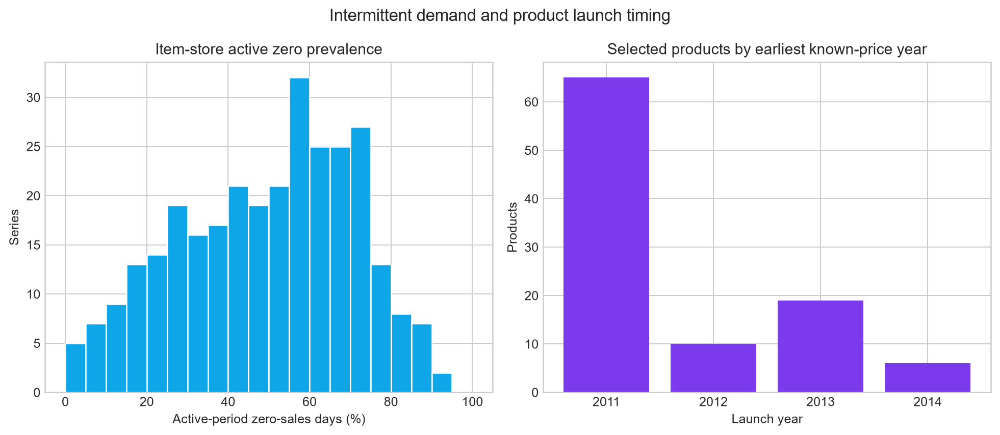

## Overall Demand Distribution

| Measure | All rows | Active-period rows |
| --- | --- | --- |
| Observations | 582,300 | 480,506 |
| Mean | 1.9681 | 2.3850 |
| Median | 0.0000 | 1.0000 |
| Standard deviation | 5.0545 | 5.4741 |
| Zero percentage | 57.9706% | 49.0668% |
| 90th percentile | 5.0000 | 6.0000 |
| 99th percentile | 25.0000 | 27.0000 |
| 99.9th percentile | 52.0000 | 54.0000 |
| Maximum | 196 | 196 |
| Skewness | 6.1659 | 5.6631 |

The histogram clips the display at p99 and uses a logarithmic positive-sales panel so the tail does not hide the bulk of the distribution. The underlying data and statistics are not clipped or changed.

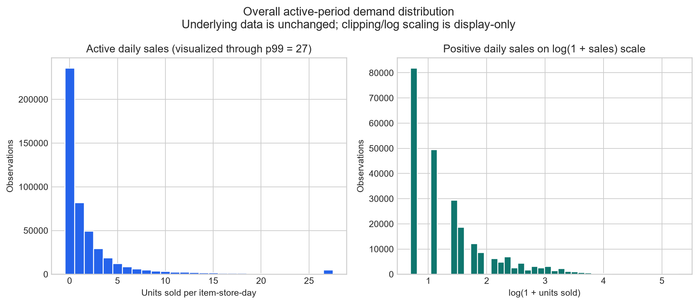

## Demand-Band Comparison

| Band | Products | Active mean | Active median | Active zero % | Median series ADI | Median series CV |
| --- | --- | --- | --- | --- | --- | --- |
| low | 33 | 0.5247 | 0.0000 | 68.6803 | 3.1561 | 1.8193 |
| medium | 34 | 1.0807 | 0.0000 | 52.8681 | 2.1846 | 1.4327 |
| high | 33 | 5.1441 | 2.0000 | 30.3449 | 1.3863 | 1.0786 |

The groups remain meaningfully separated in active-period mean demand and intermittency. This confirms that Stage 4 did not merely separate products because of different pre-launch durations.

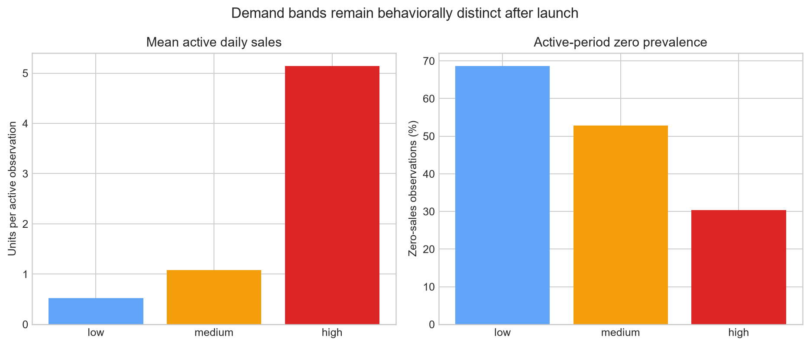

## Department Analysis

| Department | Products | Total units | Sales share | Active mean | Active median | Active zero % | Active standard deviation |
| --- | --- | --- | --- | --- | --- | --- | --- |
| FOODS_1 | 15 | 117,308 | 10.24% | 1.6777 | 0.0000 | 50.3418 | 3.0312 |
| FOODS_2 | 28 | 273,692 | 23.88% | 1.9875 | 0.0000 | 50.8155 | 4.6893 |
| FOODS_3 | 57 | 755,015 | 65.88% | 2.7668 | 1.0000 | 47.8577 | 6.2419 |

Department differences are descriptive, not causal: product composition and demand-band allocation differ between departments.

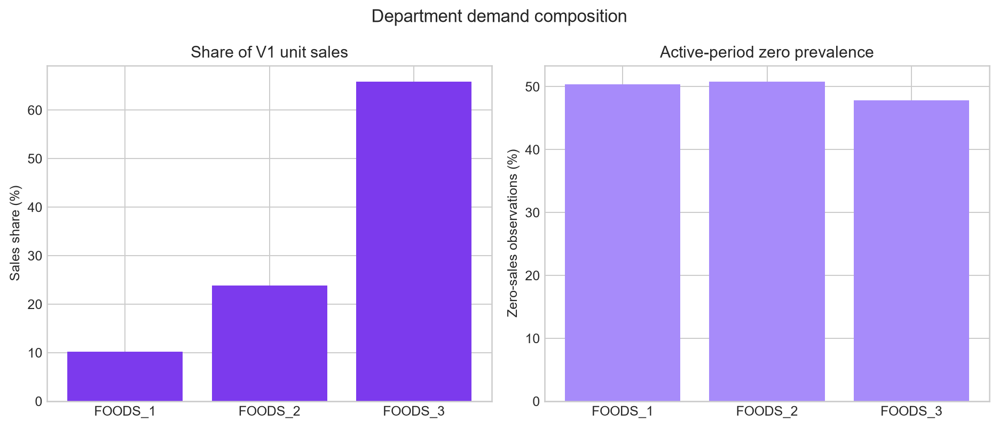

## Store Analysis

| Store | Products | Total units | Sales share | Active mean | Active median | Active zero % | Active standard deviation |
| --- | --- | --- | --- | --- | --- | --- | --- |
| CA_1 | 100 | 428,887 | 37.42% | 2.6906 | 1.0000 | 45.9288 | 5.8854 |
| TX_2 | 100 | 384,321 | 33.54% | 2.3723 | 1.0000 | 49.3553 | 5.3284 |
| WI_3 | 100 | 332,807 | 29.04% | 2.0918 | 0.0000 | 51.9170 | 5.1681 |

The highest active mean is at `CA_1` and is **28.6%** above `WI_3`. This supports retaining `store_id` as an important future modeling dimension.

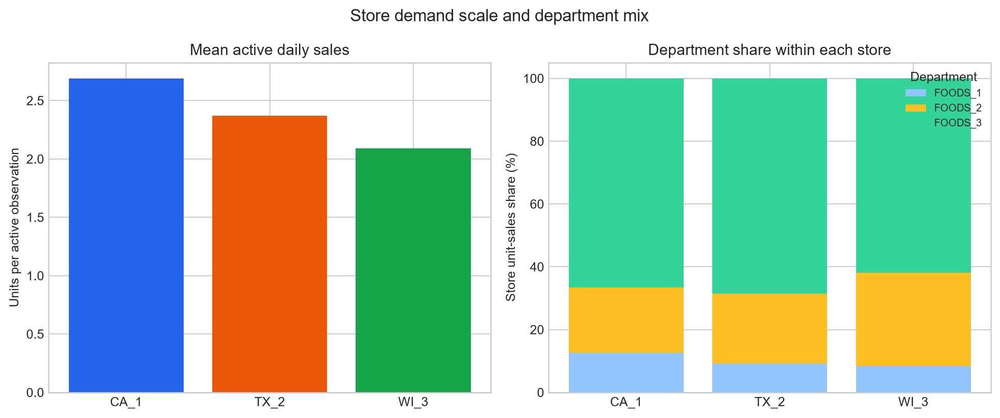

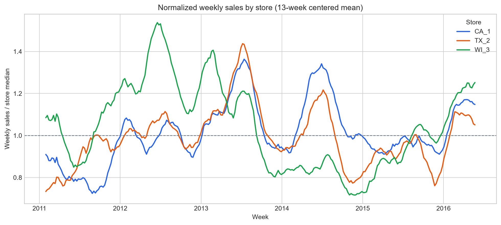

## Time Trends

| Year | Observed days | Total units | Average daily total |
| --- | --- | --- | --- |
| 2011 | 337 | 176,586 | 523.9941 |
| 2012 | 366 | 230,739 | 630.4344 |
| 2013 | 365 | 240,756 | 659.6055 |
| 2014 | 365 | 208,308 | 570.7068 |
| 2015 | 365 | 195,019 | 534.2986 |
| 2016 | 143 | 94,607 | 661.5874 |

A simple descriptive monthly linear fit changes by **17.30 units per month**, equal to **0.098%** of average monthly sales. This is not a forecast and should not be extrapolated blindly. Aggregate movement mixes genuine demand change with products becoming available. The first month (January 2011) and final month (May 2016) are partial boundary months, and 2011/2016 are partial years, so their totals are not directly comparable with complete periods.

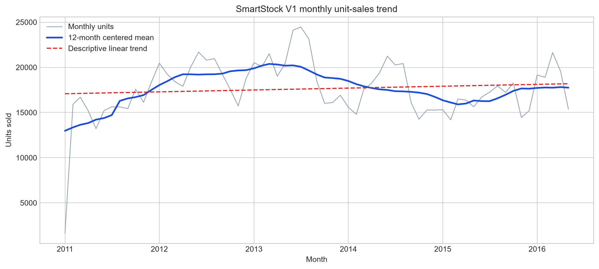

## Weekday Patterns

| Weekday | Active observations | Total units | Mean | Median |
| --- | --- | --- | --- | --- |
| Monday | 68,558 | 163,882 | 2.3904 | 1.0000 |
| Tuesday | 68,558 | 146,930 | 2.1431 | 0.0000 |
| Wednesday | 68,558 | 142,505 | 2.0786 | 0.0000 |
| Thursday | 68,558 | 140,788 | 2.0536 | 0.0000 |
| Friday | 68,558 | 156,319 | 2.2801 | 1.0000 |
| Saturday | 68,858 | 191,506 | 2.7812 | 1.0000 |
| Sunday | 68,858 | 204,085 | 2.9639 | 1.0000 |

`Sunday` has the highest active-observation mean and `Thursday` the lowest. The repeated weekday pattern supports using the existing calendar weekday field later.

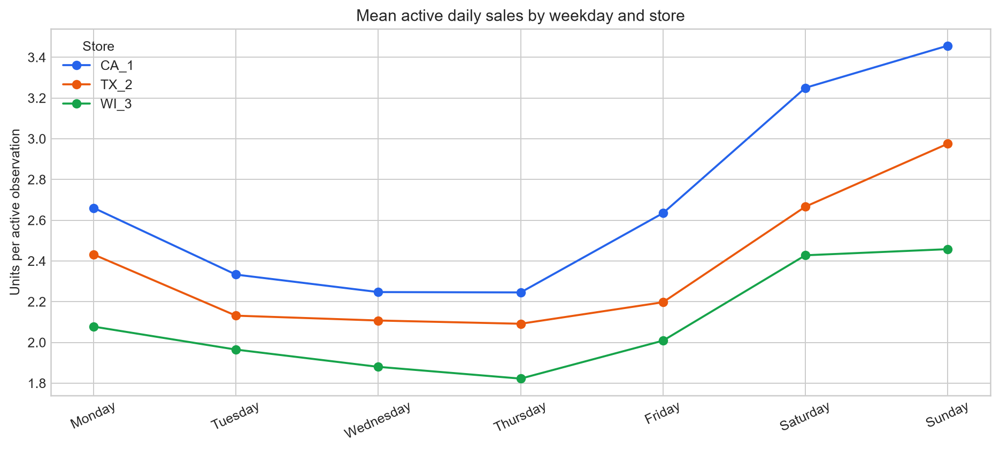

## Monthly / Seasonal Patterns

| Month | Average daily total |
| --- | --- |
| 1 | 586.3924 |
| 2 | 606.5000 |
| 3 | 603.5914 |
| 4 | 590.4500 |
| 5 | 587.5311 |
| 6 | 659.6933 |
| 7 | 634.8452 |
| 8 | 632.9226 |
| 9 | 576.1200 |
| 10 | 539.9161 |
| 11 | 518.0200 |
| 12 | 544.8516 |

Seasonality means a pattern that tends to recur at a similar point in each year. Trend means longer-term movement across years. Month averages suggest recurring calendar structure, but the trend chart also shows that years are not identical; future models should represent both without using future observations.

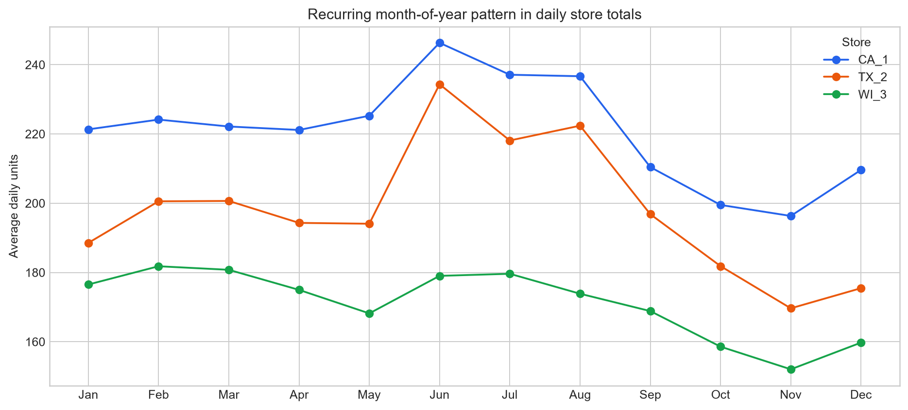

## Event / Holiday Analysis

| Day type | Calendar days | Active observations | Mean sales | Median sales | Zero % |
| --- | --- | --- | --- | --- | --- |
| Non-event | 1,783 | 441,494 | 2.3925 | 1.0000 | 48.8913 |
| Event | 158 | 39,012 | 2.3009 | 0.0000 | 51.0535 |

Observed event-day mean demand was **-3.83%** different from non-event days. This is an association, not evidence that events caused the difference; event dates overlap with seasonality, prices, store behavior, and other factors.

Event-type daily totals:

| Event type | Occurrences | Mean daily units | Median daily units |
| --- | --- | --- | --- |
| Cultural | 40 | 590.9250 | 587.0000 |
| National | 51 | 500.5098 | 521.0000 |
| Religious | 55 | 597.5818 | 570.0000 |
| Sporting | 16 | 653.4375 | 657.0000 |

## SNAP Analysis

| Store | Non-SNAP mean | SNAP mean | Difference | SNAP zero % |
| --- | --- | --- | --- | --- |
| CA_1 | 2.5714 | 2.9337 | +14.09% | 44.1662 |
| TX_2 | 2.2526 | 2.6159 | +16.13% | 47.3240 |
| WI_3 | 1.8411 | 2.6022 | +41.34% | 47.6886 |

Each store uses its corresponding state flag. The differences support evaluating SNAP as a future feature, but do not demonstrate a causal benefit-program effect.

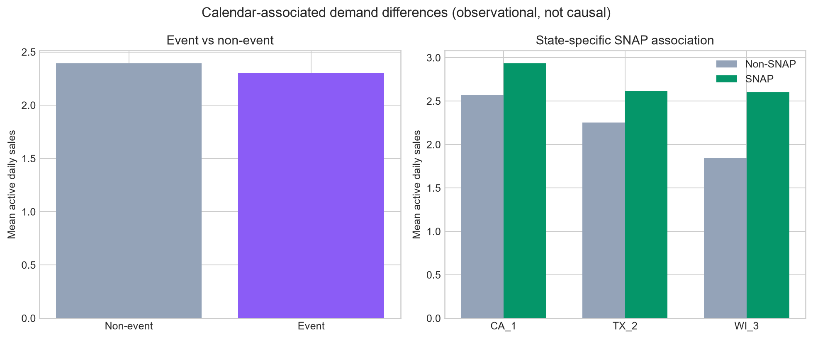

## Price Analysis

| Measure | Weekly active-period prices |
| --- | --- |
| Records | 68,858 |
| Mean | 2.7802 |
| Median | 2.5800 |
| Standard deviation | 1.6017 |
| Minimum | 0.2500 |
| 10th percentile | 1.0000 |
| 90th percentile | 4.4800 |
| 99th percentile | 9.9800 |
| Maximum | 11.5400 |

Pre-launch missing prices are excluded, not replaced with zero. Weekly records are used so a seven-day week does not receive seven times the statistical weight.

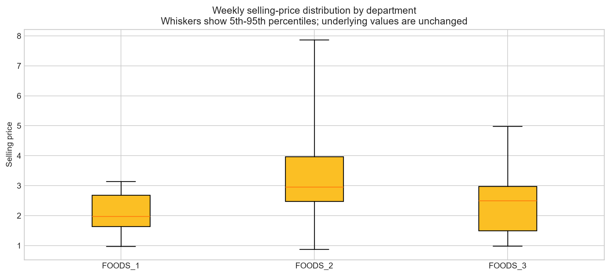

## Price-Change Investigation

| Measure | Result |
| --- | --- |
| Item-store price series | 300 |
| Series with at least one price change | 235 |
| Series with a price change (%) | 78.3333% |
| Total price-change events | 1,022 |
| Price increases | 588 |
| Price decreases | 434 |
| Median absolute percentage change | 10.6061 |
| 90th percentile absolute change | 45.9541 |
| Maximum absolute change | 1,012.0000 |

Weekly demand by price-change direction:

| Direction | Weeks | Mean weekly units | Median weekly units | Mean price change % |
| --- | --- | --- | --- | --- |
| decrease | 434 | 15.3065 | 6.0000 | -17.6176 |
| increase | 588 | 17.0323 | 7.0000 | 24.3852 |
| unchanged | 67,536 | 16.6448 | 6.0000 | 0.0000 |

Within-series price/weekly-demand correlations were available for **235** series. The median was **-0.091**, with **66.8%** negative and **33.2%** positive. Mixed directions reinforce that simple correlation cannot establish that price caused demand to change. Price, promotion timing, seasonality, product differences, events, and life cycle remain confounded.

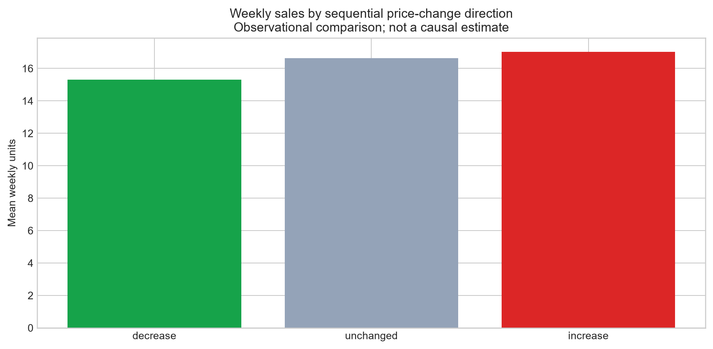

## Intermittent Demand

| Measure | Result |
| --- | --- |
| Item-store series | 300 |
| Median active zero percentage | 51.6554 |
| 90th percentile active zero percentage | 74.8471 |
| Maximum active zero percentage | 94.9861 |
| Median average demand interval | 2.0685 |
| 90th percentile average demand interval | 3.9758 |
| Maximum average demand interval | 19.9444 |

Descriptive intermittency classes:

| Class | Series |
| --- | --- |
| highly intermittent (>80% zero) | 17 |
| intermittent (50-80% zero) | 142 |
| regular (<50% zero) | 141 |

Intermittent demand is harder because many days provide a zero target and positive sales arrive irregularly. Standard regression models may overpredict zeros or underpredict bursts. Croston-style approaches could later be useful baselines for the sparsest series, but none were implemented here.

## Outlier Investigation

Percentiles and row counts below use **active-period rows only**, so unavailable pre-launch zeros do not influence the tail thresholds.

| Measure | Result |
| --- | --- |
| 99th percentile | 27.0000 |
| 99.9th percentile | 54.0000 |
| 99.99th percentile | 94.9495 |
| Maximum | 196 |
| Rows above p99.9 | 468 |
| Rows above p99.9 on event days | 45 |
| Extreme event-day share | 9.62% |

Largest daily observations:

| Date | Store | Item | Department | Sales | Price | Event | Demand band |
| --- | --- | --- | --- | --- | --- | --- | --- |
| 2012-06-10 | WI_3 | FOODS_3_635 | FOODS_3 | 196 | 1.0000 | — | high |
| 2012-07-15 | WI_3 | FOODS_3_635 | FOODS_3 | 150 | 1.0000 | — | high |
| 2013-06-23 | TX_2 | FOODS_3_319 | FOODS_3 | 135 | 0.9400 | — | high |
| 2012-07-03 | WI_3 | FOODS_3_635 | FOODS_3 | 132 | 1.0000 | — | high |
| 2011-02-05 | CA_1 | FOODS_3_383 | FOODS_3 | 130 | 1.0000 | — | high |
| 2011-09-25 | TX_2 | FOODS_3_501 | FOODS_3 | 130 | 0.7800 | — | high |
| 2012-07-06 | WI_3 | FOODS_3_635 | FOODS_3 | 129 | 1.0000 | — | high |
| 2012-09-03 | WI_3 | FOODS_3_635 | FOODS_3 | 129 | 1.0000 | LaborDay | high |
| 2015-04-14 | WI_3 | FOODS_3_635 | FOODS_3 | 128 | 0.9400 | — | high |
| 2012-07-29 | WI_3 | FOODS_3_635 | FOODS_3 | 126 | 1.0000 | — | high |
| 2012-06-18 | WI_3 | FOODS_3_635 | FOODS_3 | 125 | 1.0000 | — | high |
| 2014-07-20 | CA_1 | FOODS_3_635 | FOODS_3 | 124 | 1.0000 | — | high |
| 2015-10-13 | CA_1 | FOODS_3_501 | FOODS_3 | 120 | 0.8000 | — | high |
| 2013-07-01 | TX_2 | FOODS_3_501 | FOODS_3 | 119 | 0.8000 | — | high |
| 2012-06-11 | WI_3 | FOODS_3_635 | FOODS_3 | 117 | 1.0000 | — | high |

These values require investigation but are not automatically errors. Retail spikes may be plausible, and no values were removed or capped.

## Product Launch Behavior

| Measure | Date |
| --- | --- |
| Earliest product known-price date | 2011-01-29 |
| Latest product earliest known-price date | 2014-04-26 |
| Earliest product positive-sale date | 2011-01-29 |
| Latest product earliest positive-sale date | 2014-04-27 |

Product launch-year distribution:

| Year | Products |
| --- | --- |
| 2011 | 65 |
| 2012 | 10 |
| 2013 | 19 |
| 2014 | 6 |

The evidence supports training each item-store series on active history rather than presenting unavailable pre-launch zeros as demand observations. The exact future policy still needs approval because availability inferred from first known price is a dataset convention, not an explicit inventory record.

## Modeling Readiness

Assessment: **ready for a controlled feature-engineering and chronological-split design after launch and missing-price policies are agreed**.

The data foundation is structurally sound, but modeling should wait until launch-boundary treatment and time-aware validation are specified.

## Recommended Future Features

| Candidate feature | Stage 5 evidence |
| --- | --- |
| store_id | store active-demand scales and SNAP associations differ |
| item_id and department | demand bands, departments, and intermittency differ materially |
| weekday | weekday mean demand varies in the active-period analysis |
| month and chronological trend | monthly seasonality and multi-year structural movement are visible |
| event indicators | event and non-event observations have different average demand, subject to confounding |
| state-specific SNAP flag | SNAP/non-SNAP associations differ by store |
| sell_price and price-change proxies | most item-store series change price and demand differs across price-change directions |
| product age or active flag | pre-launch rows are structurally different from active zero-demand rows |
| lagged sales and rolling statistics | daily demand has temporal structure and intermittency; must be calculated using past values only |

These are recommendations only. No production feature columns were persisted in Stage 5.

## Leakage Risks

- Random train/test splitting would mix future observations into training; use chronological splits.
- Rolling and lag features must be shifted so the target day never contributes to its own predictors.
- Demand bands and product statistics calculated over all 1,941 days contain future-period target information and must not be model inputs as currently defined.
- Imputation, scaling, encoders, and aggregate statistics must be fitted on training periods only.
- Launch boundaries based on first future positive sale can leak future knowledge; availability should use contemporaneously known price/assortment information in production.
- Future event or promotion fields are valid only when genuinely known at forecast creation time.

Leakage occurs when information that would not have been available at prediction time influences model training. It can make evaluation look excellent while producing an unusable real-world model.

## Forecasting Challenges

- zero-heavy and intermittent active demand
- different product launch dates and active-history lengths
- store-level demand-scale differences
- department and product heterogeneity
- weekday, seasonal, event, and SNAP-associated patterns
- weekly price changes and confounded price-demand relationships
- extreme but potentially plausible retail spikes
- one-day, seven-day, and thirty-day forecast horizons

## Decisions Needed Before Next Stage

- Choose whether model-ready rows begin at first known price for each item-store series.
- Choose a non-causal missing-price policy for any future active-period gaps; current V1 has none after launch.
- Define chronological validation windows for all three forecast horizons.
- Decide whether to use global models across series, per-series baselines, or both.
- Decide how intermittent-demand baselines will be compared with general forecasting models.

## Performance Decisions

- Loaded the 582,300-row CSV once using compact numeric and categorical dtypes.
- Used vectorized operations and groupby aggregations; no manual Python loop traversed all daily rows.
- Reused daily, weekly, monthly, and series-level tables across report sections and figures.
- Reduced weekly price analysis to one item-store-week row rather than counting the same weekly price once per day.
- Used aggregate views to understand 300 time series rather than drawing 300 unreadable lines.

Aggregation makes a large collection of series understandable: totals and averages reveal common structure, while item-store metrics preserve the distribution of intermittency and launch timing. Aggregation can hide individual behavior, so the report also lists extreme and late-launch examples.

## Scope Confirmation

No persistent feature-engineering dataset, lags, rolling model inputs, train/test split, forecasting model, evaluation, PostgreSQL, inventory optimization, dashboard, Docker, or deployment work was performed. The Stage 4 CSV and manifest remained byte-for-byte unchanged.
