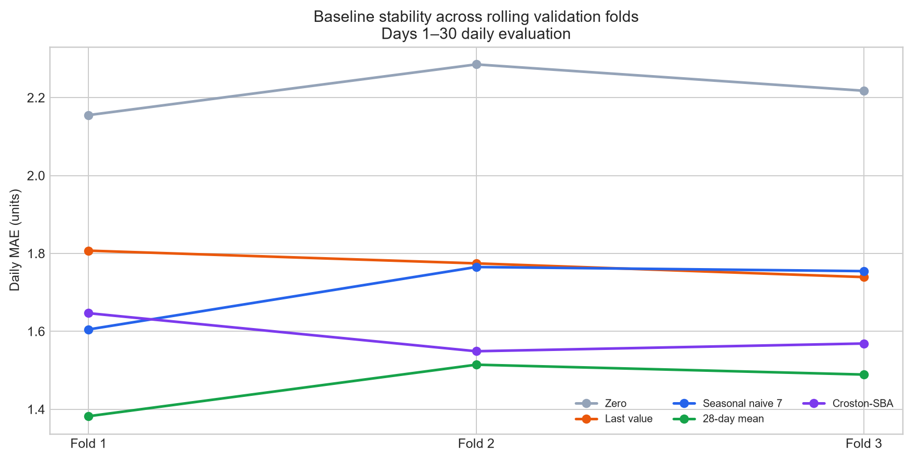
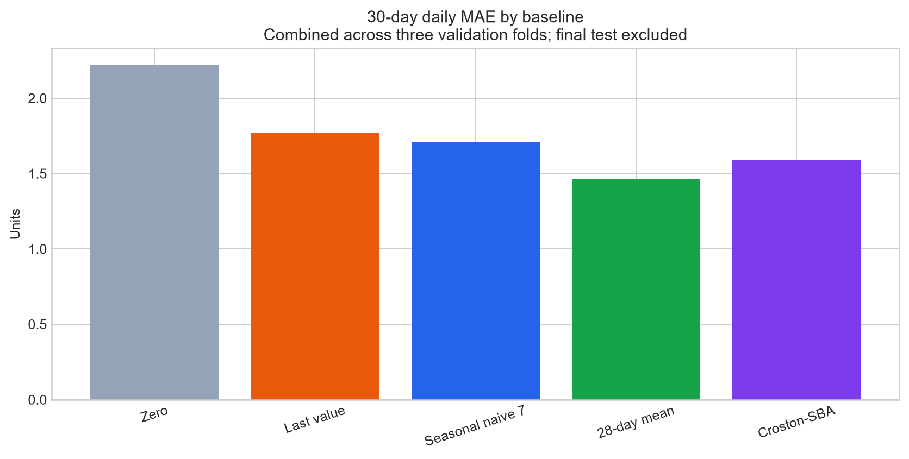
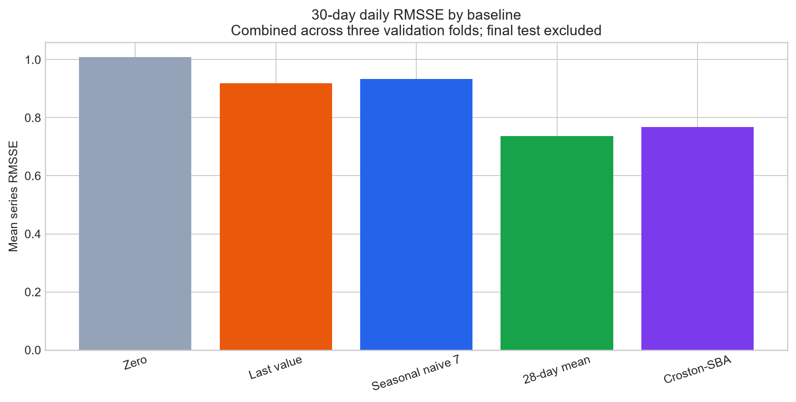
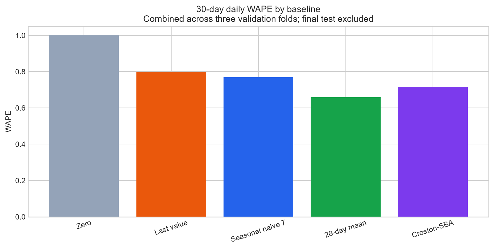
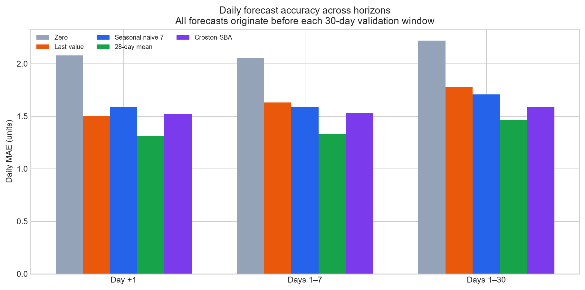
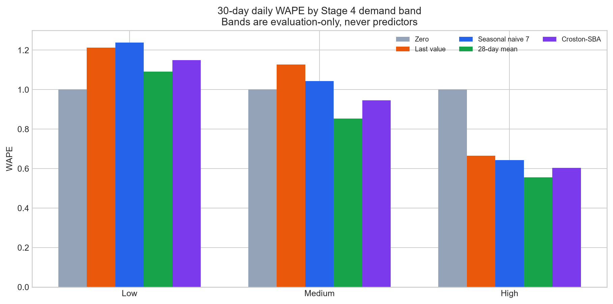
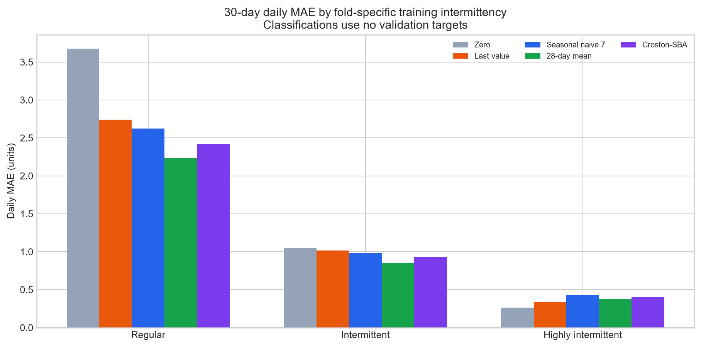
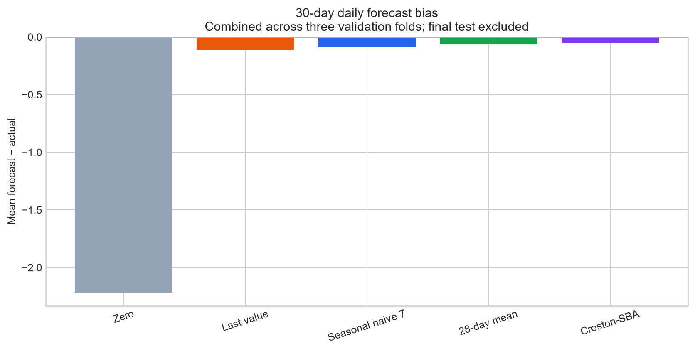

# SmartStock Stage 7 — Baseline Forecasting & Evaluation Framework

Generated at `2026-08-13T06:50:02+00:00` using the three frozen validation folds. The final test was not forecast or evaluated.

## Executive Summary

Stage 7 generated **135,000 daily validation predictions**: 300 item-store series × three folds × 30 days × five baselines. The balanced validation ranking identifies **28-day mean** as the strongest overall baseline, while individual metrics favor different methods.

The best non-zero rule reduced 30-day daily MAE by **34.14%** relative to the explicit zero sanity baseline. The latest evaluated target date is `2016-04-22`, one day before the locked final test begins.

## Baseline Definitions

- **Zero:** forecast zero every day. This is an essential floor because active demand is nearly 50% zero.
- **Last value:** repeat the final observed pre-origin sale for all 30 days.
- **7-day seasonal naive:** repeat only the final seven pre-origin observations, preserving their weekly position.
- **28-day mean:** repeat the continuous mean of the final 28 pre-origin days.
- **Croston-SBA:** use alpha `0.1` and forecast `(1 - alpha/2) × smoothed positive-demand size / smoothed inter-demand interval`. The first positive demand and its 1-based interval initialize the recursion; all-zero history returns zero.

A future forecasting model must beat simple rules before its extra complexity is useful. Persistence is meaningful because recent demand often carries information; seasonal naive tests the weekday pattern found in Stage 5; and Croston explicitly separates positive demand sizes from the intervals between them.

## Forecast-Origin Safety

Each fold makes one 30-day forecast from the day immediately before validation. All five methods receive only active sales observations ending at that origin. Stage 6 warm-up rows are valid here because their sales are observed; `is_feature_ready = false` means engineered ML predictors are incomplete, not that demand history is unknown. Validation targets remain feature-ready. Forecasts are fully created before validation actuals and analysis-only metadata are attached.

Day +2 cannot use actual Day +1 demand: at the real forecast origin, Day +1 has not happened. Reusing validation sales through precomputed row lags would simulate 30 one-day forecasts rather than one genuine 30-day forecast and would leak future information.

| Fold | Forecast origin | Validation | Prediction rows | Series |
| --- | --- | --- | --- | --- |
| validation_fold_1 | 2016-01-23 | 2016-01-24 through 2016-02-22 | 45,000 | 300 |
| validation_fold_2 | 2016-02-22 | 2016-02-23 through 2016-03-23 | 45,000 | 300 |
| validation_fold_3 | 2016-03-23 | 2016-03-24 through 2016-04-22 | 45,000 | 300 |

## Metric Definitions

- **MAE:** average absolute unit error. It is easy to explain operationally.
- **RMSE:** square root of average squared error. Squaring makes large misses count more heavily than in MAE.
- **WAPE:** total absolute error divided by total actual demand. It remains usable when individual actual days are zero, unlike ordinary MAPE. A zero group denominator returns undefined rather than an artificial epsilon result.
- **RMSSE:** each series' forecast RMSE divided by its training-only one-step naive scale, then averaged equally across defined series. This permits comparison between low- and high-volume products. Zero-scale series remain undefined and are counted.
- **Bias:** mean of `forecast - actual`. Positive values mean systematic overforecasting; negative values mean underforecasting. Those directions imply different inventory risks: excess stock versus shortages.

For aggregate 7- and 30-day RMSSE, each series' total error is divided by `sqrt(horizon × training scale)` before series scores are averaged.

## Fold-Level Results

Days 1–30 daily metrics by fold:

| Fold | Baseline | MAE | RMSE | WAPE | RMSSE | Bias |
| --- | --- | --- | --- | --- | --- | --- |
| validation_fold_1 | Croston-SBA | 1.6466 | 3.0592 | 0.7640 | 0.7847 | -0.1330 |
| validation_fold_1 | Last value | 1.8071 | 3.4164 | 0.8385 | 0.9362 | 0.4049 |
| validation_fold_1 | 28-day mean | 1.3820 | 2.6297 | 0.6413 | 0.7291 | -0.1748 |
| validation_fold_1 | 7-day seasonal naive | 1.6048 | 2.9951 | 0.7446 | 0.9256 | -0.1099 |
| validation_fold_1 | Zero | 2.1551 | 4.8112 | 1.0000 | 1.0061 | -2.1551 |
| validation_fold_2 | Croston-SBA | 1.5488 | 2.8302 | 0.6777 | 0.7556 | 0.0088 |
| validation_fold_2 | Last value | 1.7744 | 3.5528 | 0.7764 | 0.9179 | -0.4053 |
| validation_fold_2 | 28-day mean | 1.5143 | 3.0339 | 0.6626 | 0.7395 | -0.1302 |
| validation_fold_2 | 7-day seasonal naive | 1.7651 | 3.5552 | 0.7724 | 0.9401 | -0.1980 |
| validation_fold_2 | Zero | 2.2853 | 5.1285 | 1.0000 | 1.0085 | -2.2853 |
| validation_fold_3 | Croston-SBA | 1.5687 | 2.8836 | 0.7074 | 0.7614 | -0.0374 |
| validation_fold_3 | Last value | 1.7392 | 3.3775 | 0.7843 | 0.9032 | -0.3310 |
| validation_fold_3 | 28-day mean | 1.4890 | 2.7220 | 0.6714 | 0.7393 | 0.1078 |
| validation_fold_3 | 7-day seasonal naive | 1.7546 | 3.3523 | 0.7912 | 0.9366 | 0.0539 |
| validation_fold_3 | Zero | 2.2177 | 4.9302 | 1.0000 | 1.0121 | -2.2177 |

## 1-Day Horizon Results

| Baseline | MAE | RMSE | WAPE | RMSSE | Bias |
| --- | --- | --- | --- | --- | --- |
| Croston-SBA | 1.5244 | 2.7483 | 0.7333 | 0.5572 | 0.0866 |
| Last value | 1.4989 | 2.6885 | 0.7210 | 0.5959 | 0.0300 |
| 28-day mean | 1.3074 | 2.4491 | 0.6289 | 0.5029 | 0.0748 |
| 7-day seasonal naive | 1.5911 | 2.9507 | 0.7654 | 0.6278 | 0.1422 |
| Zero | 2.0789 | 4.5676 | 1.0000 | 0.6527 | -2.0789 |

Day +1 is the only horizon where the immediate pre-origin observation is literally yesterday. Persistence can therefore be more competitive here than later in the same 30-day forecast.

## 7-Day Horizon Results

Daily errors across Days 1–7:

| Baseline | MAE | RMSE | WAPE | RMSSE | Bias |
| --- | --- | --- | --- | --- | --- |
| Croston-SBA | 1.5297 | 2.8345 | 0.7433 | 0.6963 | 0.1074 |
| Last value | 1.6314 | 3.2454 | 0.7927 | 0.8122 | 0.0508 |
| 28-day mean | 1.3346 | 2.5287 | 0.6485 | 0.6443 | 0.0956 |
| 7-day seasonal naive | 1.5911 | 3.1436 | 0.7731 | 0.8435 | 0.0781 |
| Zero | 2.0581 | 4.7676 | 1.0000 | 0.8752 | -2.0581 |

Across the complete 30-day validation horizons, seasonal naive reduced MAE by **3.69%** relative to last value, suggesting useful weekly recurrence. However, the 28-day mean reduced MAE by another **14.42%** relative to seasonal naive. Weekday repetition helped versus persistence but was not the strongest smoothing rule; this is association, not a causal weekday claim.

## 30-Day Horizon Results

Daily errors across Days 1–30:

| Baseline | MAE | RMSE | WAPE | RMSSE | Bias |
| --- | --- | --- | --- | --- | --- |
| Croston-SBA | 1.5880 | 2.9260 | 0.7155 | 0.7673 | -0.0539 |
| Last value | 1.7736 | 3.4497 | 0.7991 | 0.9191 | -0.1105 |
| 28-day mean | 1.4618 | 2.8006 | 0.6586 | 0.7360 | -0.0657 |
| 7-day seasonal naive | 1.7081 | 3.3089 | 0.7697 | 0.9341 | -0.0847 |
| Zero | 2.2194 | 4.9584 | 1.0000 | 1.0089 | -2.2194 |

## Aggregate Horizon Results

Seven-day total-demand metrics:

| Baseline | MAE | RMSE | WAPE | RMSSE | Bias |
| --- | --- | --- | --- | --- | --- |
| Croston-SBA | 6.0714 | 12.1170 | 0.4214 | 0.8141 | 0.7518 |
| Last value | 8.9733 | 16.4086 | 0.6229 | 1.3774 | 0.3556 |
| 28-day mean | 4.4261 | 8.1525 | 0.3072 | 0.6680 | 0.6689 |
| 7-day seasonal naive | 4.7022 | 8.8886 | 0.3264 | 0.7120 | 0.5467 |
| Zero | 14.4067 | 29.4435 | 1.0000 | 1.7125 | -14.4067 |

Thirty-day total-demand metrics:

| Baseline | MAE | RMSE | WAPE | RMSSE | Bias |
| --- | --- | --- | --- | --- | --- |
| Croston-SBA | 20.7721 | 46.5858 | 0.3120 | 1.2876 | -1.6164 |
| Last value | 40.8878 | 71.9413 | 0.6141 | 2.9800 | -3.3144 |
| 28-day mean | 18.0725 | 39.0362 | 0.2714 | 1.1596 | -1.9716 |
| 7-day seasonal naive | 20.1467 | 38.7351 | 0.3026 | 1.4292 | -2.5400 |
| Zero | 66.5811 | 128.8105 | 1.0000 | 3.8795 | -66.5811 |

Aggregate errors matter for inventory planning because replenishment decisions often depend on total demand across a lead-time horizon, even if individual daily forecasts are imperfect. The 28-day mean has the lowest 30-day aggregate MAE, WAPE, and RMSSE, while seasonal naive has a slightly lower aggregate RMSE; this is one example of why no single metric should decide the benchmark.

## Demand-Band Results

| Demand band | Baseline | MAE | WAPE | RMSSE | Bias |
| --- | --- | --- | --- | --- | --- |
| high | Croston-SBA | 2.9547 | 0.6038 | 0.7930 | -0.2155 |
| high | Last value | 3.2586 | 0.6659 | 0.9185 | -0.3046 |
| high | 28-day mean | 2.7226 | 0.5563 | 0.7641 | -0.1497 |
| high | 7-day seasonal naive | 3.1474 | 0.6431 | 0.9158 | -0.2113 |
| high | Zero | 4.8938 | 1.0000 | 1.2558 | -4.8938 |
| low | Croston-SBA | 0.6994 | 1.1502 | 0.7405 | 0.0028 |
| low | Last value | 0.7376 | 1.2130 | 0.8645 | -0.0593 |
| low | 28-day mean | 0.6635 | 1.0911 | 0.7165 | -0.0163 |
| low | 7-day seasonal naive | 0.7530 | 1.2383 | 0.9339 | -0.0111 |
| low | Zero | 0.6081 | 1.0000 | 0.8302 | -0.6081 |
| medium | Croston-SBA | 1.1241 | 0.9466 | 0.7683 | 0.0481 |
| medium | Last value | 1.3378 | 1.1266 | 0.9727 | 0.0282 |
| medium | 28-day mean | 1.0128 | 0.8529 | 0.7275 | -0.0321 |
| medium | 7-day seasonal naive | 1.2383 | 1.0428 | 0.9521 | -0.0331 |
| medium | Zero | 1.1875 | 1.0000 | 0.9426 | -1.1875 |

Demand bands use full-history information for analysis only. They were attached after forecasts and never influenced a baseline. The **Zero** rule has the lowest low-band MAE. A zero rule leading this sparse segment is a serious warning: future models must show that improvements are real rather than merely predicting small positive quantities on many zero days.

## Store Results

| Store | Baseline | MAE | WAPE | RMSSE | Bias |
| --- | --- | --- | --- | --- | --- |
| CA_1 | Croston-SBA | 1.7198 | 0.6906 | 0.7735 | -0.0538 |
| CA_1 | Last value | 1.9973 | 0.8021 | 0.9423 | 0.0064 |
| CA_1 | 28-day mean | 1.5962 | 0.6410 | 0.7412 | -0.0833 |
| CA_1 | 7-day seasonal naive | 1.8458 | 0.7412 | 0.9346 | -0.0804 |
| CA_1 | Zero | 2.4902 | 1.0000 | 1.0265 | -2.4902 |
| TX_2 | Croston-SBA | 1.5412 | 0.7029 | 0.7422 | -0.0605 |
| TX_2 | Last value | 1.6931 | 0.7722 | 0.8754 | -0.0358 |
| TX_2 | 28-day mean | 1.3982 | 0.6377 | 0.7098 | -0.0618 |
| TX_2 | 7-day seasonal naive | 1.6760 | 0.7644 | 0.9054 | 0.0347 |
| TX_2 | Zero | 2.1924 | 1.0000 | 0.9826 | -2.1924 |
| WI_3 | Croston-SBA | 1.5031 | 0.7609 | 0.7861 | -0.0474 |
| WI_3 | Last value | 1.6303 | 0.8253 | 0.9396 | -0.3021 |
| WI_3 | 28-day mean | 1.3909 | 0.7041 | 0.7569 | -0.0520 |
| WI_3 | 7-day seasonal naive | 1.6027 | 0.8113 | 0.9623 | -0.2082 |
| WI_3 | Zero | 1.9754 | 1.0000 | 1.0176 | -1.9754 |

## Department Results

| Department | Baseline | MAE | WAPE | RMSSE | Bias |
| --- | --- | --- | --- | --- | --- |
| FOODS_1 | Croston-SBA | 1.5191 | 0.7734 | 0.8302 | 0.0327 |
| FOODS_1 | Last value | 1.9864 | 1.0113 | 1.0558 | 0.4358 |
| FOODS_1 | 28-day mean | 1.4752 | 0.7510 | 0.8087 | 0.0501 |
| FOODS_1 | 7-day seasonal naive | 1.7664 | 0.8993 | 1.0713 | 0.0420 |
| FOODS_1 | Zero | 1.9642 | 1.0000 | 1.0460 | -1.9642 |
| FOODS_2 | Croston-SBA | 1.4439 | 0.9951 | 0.7478 | 0.0706 |
| FOODS_2 | Last value | 1.4087 | 0.9708 | 0.8770 | -0.3915 |
| FOODS_2 | 28-day mean | 1.1811 | 0.8139 | 0.7120 | -0.2033 |
| FOODS_2 | 7-day seasonal naive | 1.3861 | 0.9552 | 0.8895 | -0.2803 |
| FOODS_2 | Zero | 1.4511 | 1.0000 | 0.9080 | -1.4511 |
| FOODS_3 | Croston-SBA | 1.6770 | 0.6295 | 0.7603 | -0.1378 |
| FOODS_3 | Last value | 1.8968 | 0.7120 | 0.9038 | -0.1162 |
| FOODS_3 | 28-day mean | 1.5961 | 0.5991 | 0.7286 | -0.0286 |
| FOODS_3 | 7-day seasonal naive | 1.8510 | 0.6948 | 0.9199 | -0.0219 |
| FOODS_3 | Zero | 2.6639 | 1.0000 | 1.0487 | -2.6639 |

## Intermittency Results

| Training intermittency | Baseline | MAE | WAPE | RMSSE | Bias |
| --- | --- | --- | --- | --- | --- |
| highly_intermittent | Croston-SBA | 0.4038 | 1.5470 | 0.7771 | -0.0041 |
| highly_intermittent | Last value | 0.3403 | 1.3036 | 0.8442 | -0.0912 |
| highly_intermittent | 28-day mean | 0.3800 | 1.4558 | 0.7596 | -0.0150 |
| highly_intermittent | 7-day seasonal naive | 0.4283 | 1.6410 | 1.0311 | 0.0333 |
| highly_intermittent | Zero | 0.2610 | 1.0000 | 0.8036 | -0.2610 |
| intermittent | Croston-SBA | 0.9293 | 0.8826 | 0.7622 | -0.0033 |
| intermittent | Last value | 1.0186 | 0.9674 | 0.9210 | -0.0691 |
| intermittent | 28-day mean | 0.8538 | 0.8109 | 0.7276 | -0.0520 |
| intermittent | 7-day seasonal naive | 0.9803 | 0.9310 | 0.9378 | -0.0686 |
| intermittent | Zero | 1.0529 | 1.0000 | 0.9064 | -1.0529 |
| regular | Croston-SBA | 2.4214 | 0.6585 | 0.7712 | -0.1126 |
| regular | Last value | 2.7385 | 0.7447 | 0.9266 | -0.1558 |
| regular | 28-day mean | 2.2295 | 0.6063 | 0.7416 | -0.0864 |
| regular | 7-day seasonal naive | 2.6253 | 0.7139 | 0.9179 | -0.1163 |
| regular | Zero | 3.6774 | 1.0000 | 1.1413 | -3.6774 |

Each classification was recomputed separately using only training history available at that fold's origin.

## Croston-SBA Analysis

| Training class | Croston MAE | Croston WAPE | Croston RMSSE | MAE rank | Best MAE baseline | Best MAE |
| --- | --- | --- | --- | --- | --- | --- |
| highly_intermittent | 0.4038 | 1.5470 | 0.7771 | 4 | Zero | 0.2610 |
| intermittent | 0.9293 | 0.8826 | 0.7622 | 2 | 28-day mean | 0.8538 |
| regular | 2.4214 | 0.6585 | 0.7712 | 2 | 28-day mean | 2.2295 |

Croston did not achieve the lowest MAE in any training-intermittency class. For highly intermittent series it ranked **4 of 5**, while zero had the best MAE. Croston remains informative as a specialized benchmark, but the validation evidence does not support assuming it wins simply because demand is intermittent.

## Forecast Bias

| Baseline | Mean bias | Aggregate bias |
| --- | --- | --- |
| Croston-SBA | -0.0539 | -1,454.7763 |
| Last value | -0.1105 | -2,983.0000 |
| 28-day mean | -0.0657 | -1,774.4288 |
| 7-day seasonal naive | -0.0847 | -2,286.0000 |
| Zero | -2.2194 | -59,923.0000 |

All five 30-day daily baselines underforecast on average. Croston-SBA is closest to zero bias at **-0.0539 units/day**, while the zero rule is necessarily most negative. Low average bias does not by itself mean low absolute error.

## Fold Stability

The 28-day mean has the lowest MAE in each of the three folds, although its error level changes across time. This consistency supports using it as the main simple benchmark. A baseline that is slightly better on average but unstable would be a weaker comparison standard for Stage 8.

## Best Baseline Trade-offs

| Metric | Best baseline |
| --- | --- |
| mae | 28-day mean |
| rmse | 28-day mean |
| wape | 28-day mean |
| rmsse | 28-day mean |
| absolute_bias | Croston-SBA |

Balanced ranking across MAE, RMSE, WAPE, RMSSE, and absolute bias:

| Baseline | Mean rank | MAE | RMSE | WAPE | RMSSE | Absolute bias |
| --- | --- | --- | --- | --- | --- | --- |
| 28-day mean | 1.2000 | 1.4618 | 2.8006 | 0.6586 | 0.7360 | 0.0657 |
| Croston-SBA | 1.8000 | 1.5880 | 2.9260 | 0.7155 | 0.7673 | 0.0539 |
| 7-day seasonal naive | 3.2000 | 1.7081 | 3.3089 | 0.7697 | 0.9341 | 0.0847 |
| Last value | 3.8000 | 1.7736 | 3.4497 | 0.7991 | 0.9191 | 0.1105 |
| Zero | 5.0000 | 2.2194 | 4.9584 | 1.0000 | 1.0089 | 2.2194 |

No single metric decides the winner. **28-day mean** has the strongest balanced validation rank and becomes the principal simple benchmark for future models, while the metric-specific leaders remain important comparators.

## Implications for ML Models

- A future ML model must improve on these baselines across multiple folds and horizons, not merely one metric.
- The zero baseline remains a required check for sparse segments.
- Global models should be evaluated by store, department, demand band, and fold-specific intermittency, even though the latter two are not predictors.
- Daily predictions must remain origin-safe when aggregated into 7- and 30-day business totals.

## Final-Test Lock Confirmation

The locked period is `2016-04-23` through `2016-05-22`. No Stage 7 prediction or metric was generated for it. The latest evaluated date is `2016-04-22`.

The code rejects any evaluation window that overlaps the lock, and automated tests exercise that safeguard.

## Limitations / Open Questions

- Baseline rules do not use price, event, SNAP, product-age, or hierarchy predictors.
- Croston alpha is fixed at 0.1 and was not tuned.
- Aggregate RMSSE uses a documented horizon-scaled extension rather than an official M5 competition aggregate metric.
- Demand bands remain full-history analysis labels.
- Sales can be censored by unobserved stockouts.
- Stage 8 still needs an agreed first ML model, preprocessing policy, and metric-based acceptance criteria.

No advanced model, final-test evaluation, hyperparameter tuning, database, inventory logic, dashboard, or deployment work was performed.
