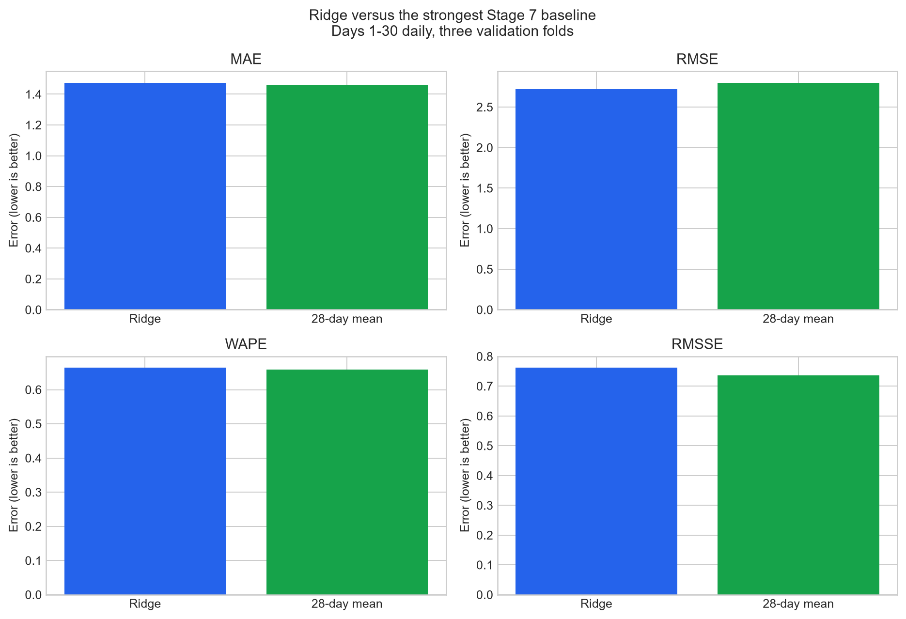
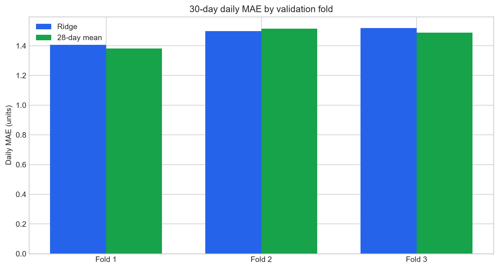
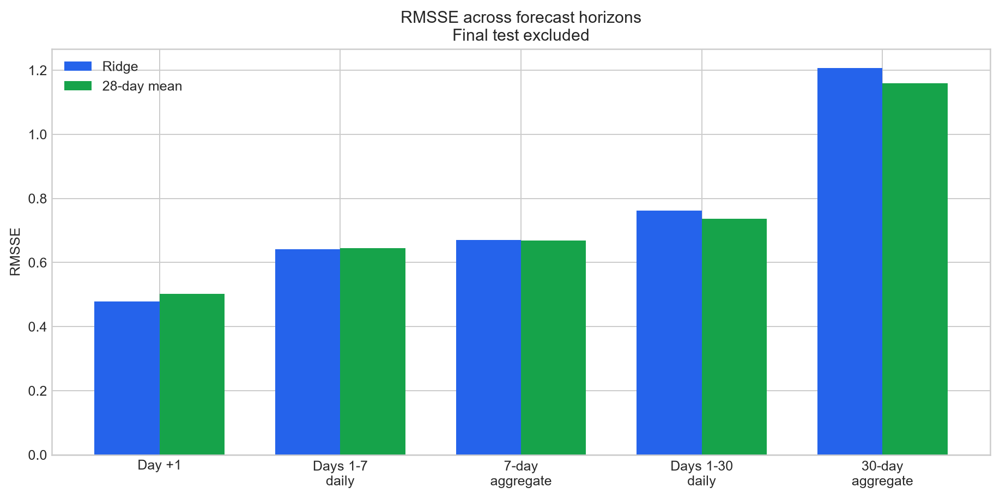
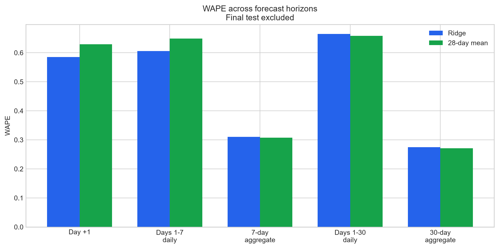
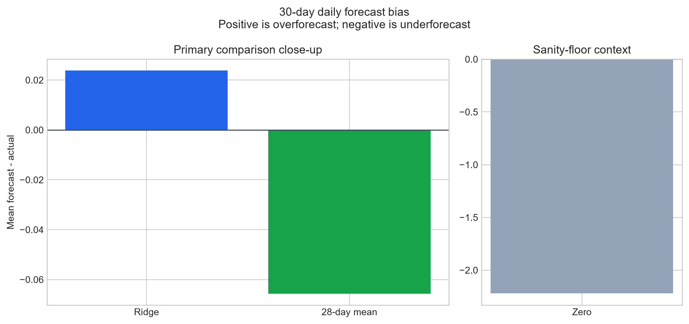
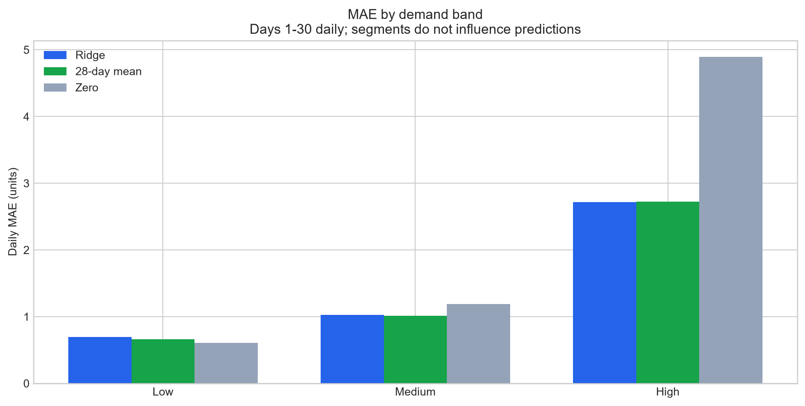
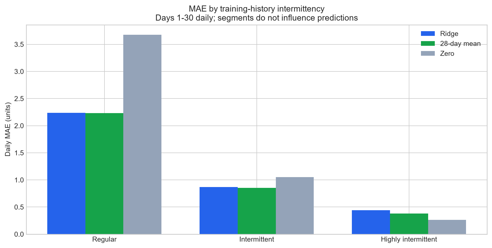
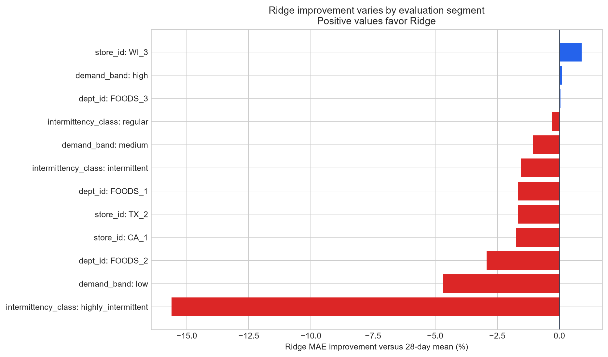

# SmartStock Stage 8 — Global Ridge Regression & Recursive Multi-Step Forecasting

## Executive Summary

Ridge did not establish a balanced, consistent improvement over the 28-day mean. Its results remain useful as the first global linear-model benchmark.

Across the combined Days 1–30 daily evaluation, Ridge produced MAE **1.475**, RMSE **2.722**, WAPE **66.44%**, RMSSE **0.762**, and signed bias **0.024**. The official comparison is the tracked Stage 7 28-day mean, not a hard-coded benchmark.

## Why Ridge Was Chosen

Ridge is ordinary linear regression plus an L2 penalty on coefficient size. The penalty discourages unstable, very large coefficients when predictors overlap. It provides a transparent first global ML test before moving to nonlinear models.

## Frozen Stage 8 Feature Set

The tracked configuration freezes 26 inputs before one-hot encoding:

Categorical: `item_id`, `store_id`, `dept_id`, `event_name_1`, `event_type_1`, `event_name_2`, `event_type_2`.

Numeric/calendar/history: `year`, `day_of_month`, `is_weekend`, `day_of_week_sin`, `day_of_week_cos`, `month_sin`, `month_cos`, `is_event`, `snap_active`, `product_age_days`, `sales_lag_1`, `sales_lag_7`, `sales_lag_14`, `sales_lag_28`, `sales_roll_mean_7`, `sales_roll_mean_14`, `sales_roll_mean_28`, `sales_roll_std_7`, `sales_roll_std_28`.

## Features Deliberately Excluded

The target, demand band, all price fields, zero-rate fields, days-since-last-positive, redundant identity fields, and control fields were excluded. Price is deferred because a 30-day deployment forecast needs an explicit future-price-information policy. Discrete intermittency-state features are deferred because recursively updating them from fractional forecasts would add a hidden modeling decision.

## Preprocessing Pipeline

Missing categorical values become `__NONE__`, categories are one-hot encoded with unknown categories ignored, and numeric inputs are standardized. Each encoder and scaler is fitted only on that fold's training rows. The sales target is not standardized.

## Global Model Architecture

One Ridge model is fitted per fold across all feature-ready observations from all 300 item-store series. Item and store one-hot indicators allow series-specific levels while shared calendar and demand-history coefficients learn across the complete panel.

## Recursive Forecasting Design

Day +1 is predicted from actual history through the origin. The clipped Day +1 prediction is appended to synthetic history and becomes available to Day +2 lags and rolling windows. This repeats through Day +30; no validation actual enters the synthetic history.

## Forecast-Origin Leakage Protection

Using the persisted Stage 6 Day +20 lag fields directly would reveal actual validation sales from Days +1 through +19. Stage 8 instead selects only approved future calendar/context fields and recomputes every demand lag and rolling statistic from real pre-origin history plus earlier model predictions.

## Negative Prediction Handling

Ridge generated 1,917 negative raw values (7.10%); the most negative was -0.428. Sales cannot be negative, so the predeclared official rule clipped them to zero without rounding.

## Validation Fold Results

| Fold | Ridge MAE | 28-day mean MAE | MAE improvement | Ridge RMSSE | Bias |
|---|---|---|---|---|---|
| Fold 1 | 1.407 | 1.382 | -1.78% | 0.754 | -0.054 |
| Fold 2 | 1.498 | 1.514 | 1.07% | 0.764 | -0.019 |
| Fold 3 | 1.519 | 1.489 | -2.04% | 0.768 | 0.145 |

## Day+1 Results

| Metric | Ridge | 28-day mean | Improvement |
|---|---|---|---|
| MAE | 1.216 | 1.307 | 6.98% |
| RMSE | 2.212 | 2.449 | 9.67% |
| WAPE | 58.50% | 62.89% | 6.98% |
| RMSSE | 0.479 | 0.503 | 4.78% |

Ridge bias: **-0.121**; 28-day mean bias: **0.075**.

## Days 1–7 Results

| Metric | Ridge | 28-day mean | Improvement |
|---|---|---|---|
| MAE | 1.246 | 1.335 | 6.63% |
| RMSE | 2.477 | 2.529 | 2.06% |
| WAPE | 60.55% | 64.85% | 6.63% |
| RMSSE | 0.641 | 0.644 | 0.58% |

Ridge bias: **-0.153**; 28-day mean bias: **0.096**.

## 7-Day Aggregate Results

| Metric | Ridge | 28-day mean | Improvement |
|---|---|---|---|
| MAE | 4.475 | 4.426 | -1.10% |
| RMSE | 8.239 | 8.153 | -1.07% |
| WAPE | 31.06% | 30.72% | -1.10% |
| RMSSE | 0.670 | 0.668 | -0.32% |

Ridge bias: **-1.074**; 28-day mean bias: **0.669**.

## Days 1–30 Results

| Metric | Ridge | 28-day mean | Improvement |
|---|---|---|---|
| MAE | 1.475 | 1.462 | -0.88% |
| RMSE | 2.722 | 2.801 | 2.81% |
| WAPE | 66.44% | 65.86% | -0.88% |
| RMSSE | 0.762 | 0.736 | -3.54% |

Ridge bias: **0.024**; 28-day mean bias: **-0.066**.

## 30-Day Aggregate Results

| Metric | Ridge | 28-day mean | Improvement |
|---|---|---|---|
| MAE | 18.306 | 18.073 | -1.29% |
| RMSE | 36.945 | 39.036 | 5.36% |
| WAPE | 27.49% | 27.14% | -1.29% |
| RMSSE | 1.206 | 1.160 | -4.03% |

Ridge bias: **0.716**; 28-day mean bias: **-1.972**.

## Comparison with 28-Day Mean

For the principal 30-day daily comparison, Ridge's MAE change was **-0.88%**, RMSE change **2.81%**, WAPE change **-0.88%**, and RMSSE change **-3.54%**. Positive means Ridge improved; negative means it worsened.

## Store Results

| Segment | Ridge MAE | 28-day mean MAE | Zero MAE | Ridge bias | MAE vs mean |
|---|---|---|---|---|---|
| CA_1 | 1.624 | 1.596 | 2.490 | 0.056 | -1.75% |
| TX_2 | 1.421 | 1.398 | 2.192 | 0.059 | -1.66% |
| WI_3 | 1.378 | 1.391 | 1.975 | -0.044 | 0.90% |

## Department Results

| Segment | Ridge MAE | 28-day mean MAE | Zero MAE | Ridge bias | MAE vs mean |
|---|---|---|---|---|---|
| FOODS_1 | 1.500 | 1.475 | 1.964 | 0.137 | -1.65% |
| FOODS_2 | 1.216 | 1.181 | 1.451 | -0.108 | -2.94% |
| FOODS_3 | 1.595 | 1.596 | 2.664 | 0.059 | 0.05% |

## Demand-Band Results

| Segment | Ridge MAE | 28-day mean MAE | Zero MAE | Ridge bias | MAE vs mean |
|---|---|---|---|---|---|
| low | 0.695 | 0.663 | 0.608 | 0.032 | -4.69% |
| medium | 1.023 | 1.013 | 1.187 | -0.027 | -1.05% |
| high | 2.720 | 2.723 | 4.894 | 0.068 | 0.11% |

## Intermittency Results

| Segment | Ridge MAE | 28-day mean MAE | Zero MAE | Ridge bias | MAE vs mean |
|---|---|---|---|---|---|
| regular | 2.236 | 2.229 | 3.677 | 0.098 | -0.30% |
| intermittent | 0.867 | 0.854 | 1.053 | -0.057 | -1.55% |
| highly_intermittent | 0.439 | 0.380 | 0.261 | 0.094 | -15.61% |

## Forecast Bias

The combined 30-day daily Ridge bias was **0.024**, compared with **-0.066** for the 28-day mean. Positive bias means systematic overforecasting; negative bias means underforecasting. These directions have different inventory consequences even when absolute accuracy is similar.

## Fold Stability

Ridge's MAE improvement was not consistent across all three folds, so time-period sensitivity is an important warning.

## Raw Negative Prediction Diagnostics

Count: **1,917**; percentage: **7.10%**; most negative raw value: **-0.428**. All official forecasts are non-negative and remain continuous.

## Leakage Audits

- **validation_fold_1**: all 12 forecast-origin checks passed; origin 2016-01-23.
- **validation_fold_2**: all 12 forecast-origin checks passed; origin 2016-02-22.
- **validation_fold_3**: all 12 forecast-origin checks passed; origin 2016-03-23.
- Validation-target and precomputed-future-feature mutation audit: **PASS**.
- Fold-only encoder/scaler audit: **PASS**.
- Final-test lock: **PASS**; latest evaluated date 2016-04-22.

## Model Limitations

Training features use actual prior demand, while later recursive validation features partly use earlier Ridge predictions. This exposure mismatch is normal for recursive forecasting, but early errors can propagate through later lags and rolling windows. Ridge also assumes additive linear effects and cannot naturally express complex thresholds or interactions.

## Recommendation for Stage 9

The next reviewed experiment may consider one controlled nonlinear global model because Ridge's additive linear assumptions did not dominate the simple baseline.

The final test remains locked. Any Stage 9 model should use the same origins, recursive policy, official metrics, and baseline comparisons before final model selection.

## Evaluation Figures

